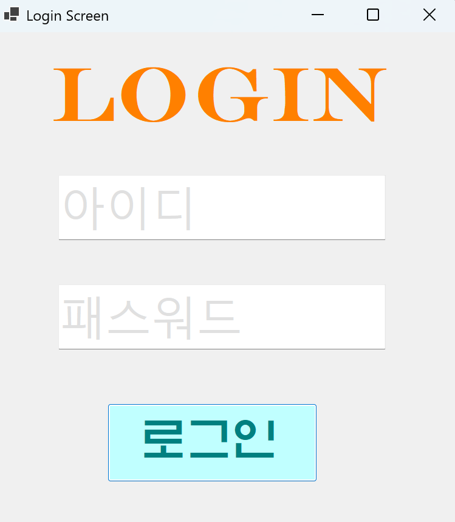
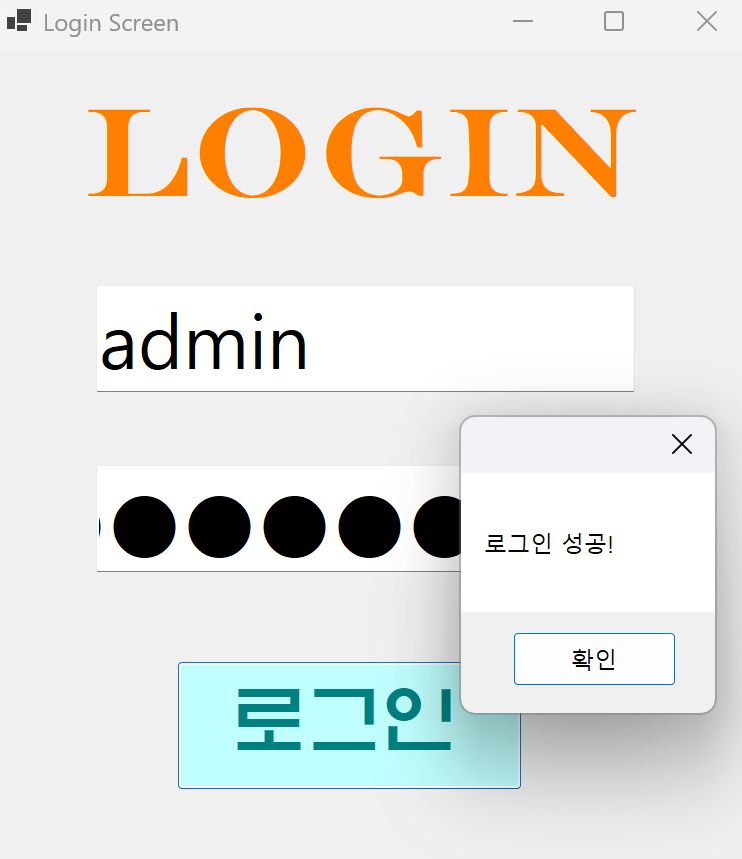
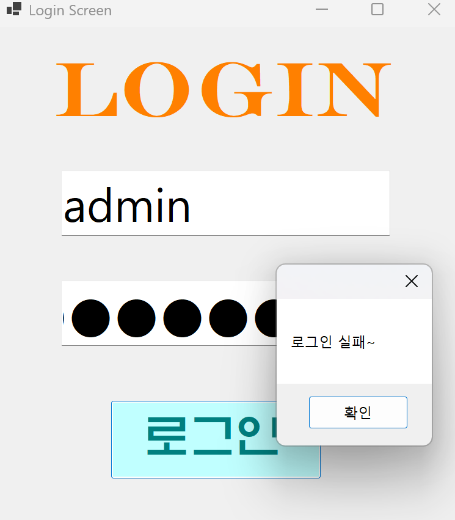
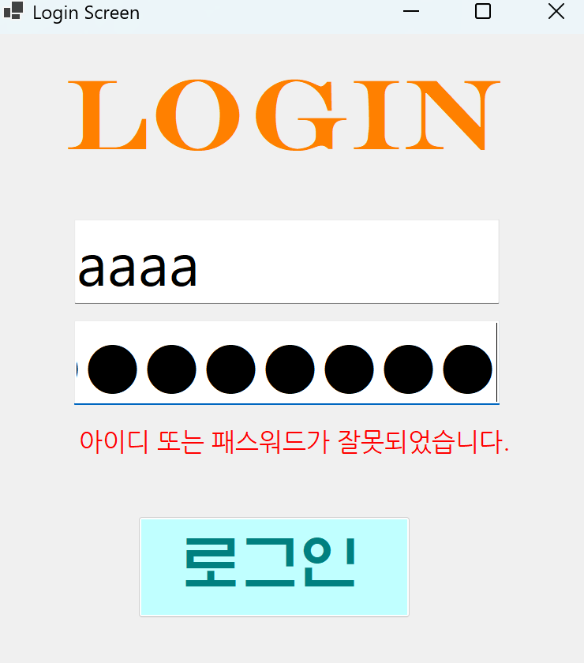

# (C# 코딩) 로그인 스크린
## 개요
- C# 프로그래밍 학습
- 1줄 소개: 사용자의 아이디와 패스워드를 입력받는 로그인 화면
- 사용한 플랫폼:
	- C#, .NET Windows Forms, Visual Studio, GitHub
- 사용한 컨트롤:
	- Label, TextBox, Button
- 사용한 기술과 구현한 기능:
	- Visual Studio를 이용하여 UI 디자인
	- string 클래스를 이용한 사용자 입력 데이터 처리
	- 패스워드 입력 내용을 숨기는 기능 구현
	- Placeholder 기능 구현
	- 탭 순서를 이용하여, 프로그램을 켰을때 포커스가 btnLogin에 가도록 설정.

## 실행 화면 (과제1)
- 과제1 코드의 실행 스크린샷

- 과제 내용
	- Label(표시), TextBox(입력), Button(전송)을 적절히 배치합니다.
	- 아이디와 패스워드를 입력받아, 적절한지 확인합니다.
	- TextBox에 PlaceHolder 기능을 구현하여 안내 문구를 보여줍니다. 
	- 패스워드가 사용자에게 보이지 않도록 설정.

- 구현 내용과 기능 설명
	- 처음 실행시 입력 포커스가 btnLogin에 가도록 설정합니다. 
	- 아이디와 패스워드를 입력받는 textBox에는 안내문구가 뜨도록 설정 및 Enter가 발생하면 안내문구 삭제, Leave가 발생할 경우 안내문구를 복원합니다.
	- 아이디와 패스워드가 맞을 경우 '로그인 성공' 메시지박스가, 틀릴 경우 '로그인 실패' 메시지 박스가 뜨도록 설정.
	- 패스워드 입력시 입력한 내용이 보이지 않도록 설정. 

## 실행 화면 (과제2)
- 과제2 코드의 실행 스크린샷
 

- 과제 내용
	- 로그인 성공 시 성공 메시지를 메시지 박스를 통해 표시.
	- 로그인 실패 시 실패 메시지를 표시함. 
	- 로그인 실패 후 다음 시도에서 성공한다면, 기존에 보이던 로그인 실패 메시지를 다시 안보이게 수정.
	- txtID에서 엔터를 치면 txtPW로, txtPW에서 엔터를 치면 btnLogin으로 포커스 이동.

- 구현 내용과 기능 설명
	- 메시지 박스를 이용하여, 아이디와 패스워드가 둘 다 일치하면 로그인 성공 메시지 박스를 띄움. 
	- visible 기능을 이용하여, 아이디 혹은 패스워드가 일치하지 않으면 로그인 실패 메시지를 표시함.
	- 로그인 실패 후, 다음 시도에서 로그인에 성공한다면 기존 로그인 실패 메시지를 안보이게 숨김. 
	- txtID에서 엔터를 치면 txtPW로, txtPW에서 엔터를 치면 btnLogin으로 포커스 이동.
